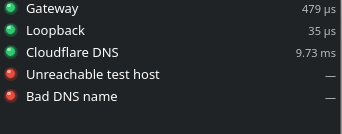
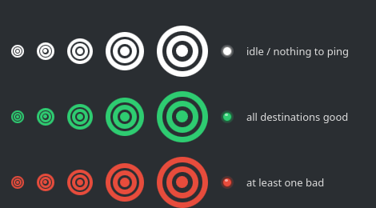
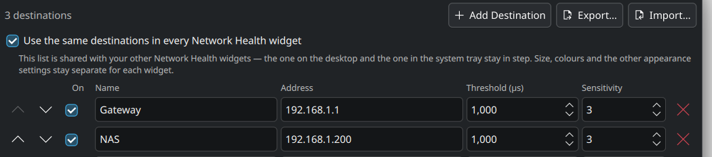
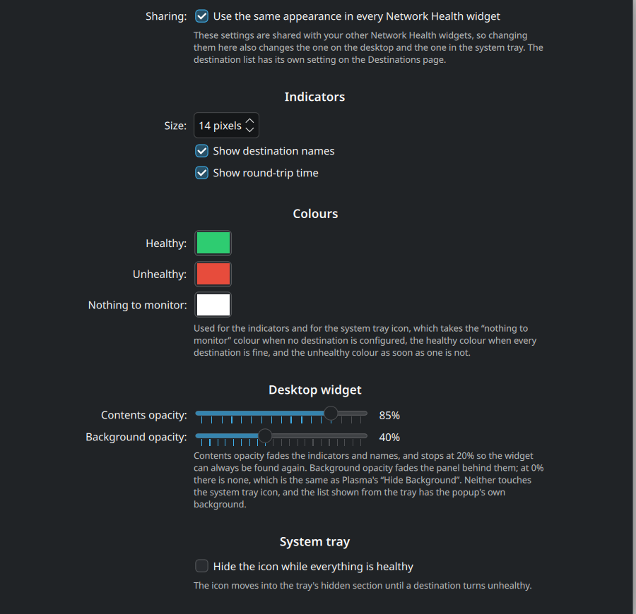

# Plasma Network Health

A KDE Plasma 6 widget that answers one question at a glance: **is my network still fine?**

You give it a list of hosts. Each one gets a round LED next to its name — green while it
answers pings quickly enough, red when it stops. In the system tray it collapses to a single
target icon that is white when there is nothing to watch, green while everything is fine, and
red the moment anything is not.





## Why is it built this way

Widespread ping monitors usually run `ping` from inside the widget. That puts a fork, an exec, a process
teardown and a blocking wait inside `plasmashell` for every sample of every host — and when the
network misbehaves, that is exactly when the desktop should *not* be waiting on anything.

This widget never touches the network. All probing happens in a separate process:

```
  plasma-network-healthd                      plasmashell
  ─────────────────────────                   ────────────────────────
  one epoll loop                              Network Health widget
  one ICMP socket per family     writes       ┌──────────────────────┐
  all destinations multiplexed   ───────────► │ re-reads one small   │
  DNS on a worker thread         state.ini    │ file once per probe  │
                                              │ interval             │
                                 reads        │                      │
  clients/<widget>.json  ◄─────────────────── │ writes only when you │
                                              │ change the config    │
                                              └──────────────────────┘
```

* The backend sends every probe that is due in a **single wakeup**, so one hundred destinations
  cost the same number of timer expiries as one.
* Destinations that share an address, interval and timeout, including across several widget
  instances, share one probe stream, so a host is never pinged twice.
* The only blocking call in the backend, `getaddrinfo()`, runs on a worker thread.
* The widget's entire per-tick cost is `QSettings::sync()` on a file in `/run/user/<uid>`, which
  is a `stat()` when nothing changed and a small parse when it did. Nothing in `plasmashell` can
  block on the network, because nothing in `plasmashell` talks to it.

Measured in steady state on 128 destinations probed once a second, most of them deliberately
unreachable so that every one of them times out every second — the worst case the widget
allows: **0.22 % of one core, 3.5 MB RSS, 4.6 wakeups a second** in the backend. With nothing
configured, it blocks in `epoll_wait` and uses no CPU at all. A realistic handful of destinations
does not even register.

## Requirements

* KDE Plasma 6
* CMake 3.16+ and a C++17 compiler (`g++` or `clang++`). The backend has no
  dependencies beyond libc and the Linux headers
* Unprivileged ICMP, which is the default on every systemd distribution
  (`net.ipv4.ping_group_range = 0 2147483647`). The installer will check and tell you what to do
  if your system disagrees.

## Install

```bash
./install.sh
```

That should build the backend into `~/.local/bin/plasma-network-healthd` and register the widget with
`kpackagetool6`. No root needed. Nothing is written outside your home directory. 

## Usage

* **Desktop:** right-click the desktop → *Add Widgets…* → **Network Health**
* **System tray:** right-click the tray → *Configure System Tray…* → *Entries* → set
  **Network Health** to *Shown*

On first run the widget looks up your default gateway and adds it as a single destination, so
there is something to look at immediately.

To remove everything again:

```bash
./uninstall.sh
```

Your destinations and appearance live in `~/.config/plasma-network-health` and are left alone;
delete that directory too if you want nothing behind.

### Building it yourself

`install.sh` is a wrapper around an ordinary CMake build, which is also what a distribution
package would use:

```bash
cmake -S . -B build -DCMAKE_INSTALL_PREFIX=/usr
cmake --build build
DESTDIR="$pkgdir" cmake --install build
```

That puts the backend in `/usr/bin`, the widget in `/usr/share/plasma/plasmoids/` and the
systemd user unit in `/usr/lib/systemd/user/`, with `ExecStart` pointing at wherever the backend
actually landed.

| Option | Default | Effect |
| --- | --- | --- |
| `BUILD_DAEMON` | `ON` | build the backend |
| `INSTALL_PLASMOID` | `ON` | install the widget package |
| `INSTALL_SYSTEMD_UNIT` | `ON` | install the systemd user unit |
| `SYSTEMD_USER_UNIT_DIR` | `<prefix>/lib/systemd/user` | where that unit goes |
| `STATIC_LIBSTDCXX` | `OFF` | link libstdc++/libgcc statically |

`STATIC_LIBSTDCXX=ON` leaves `libc.so.6` as the backend's only shared dependency, which is what
makes a release tarball runnable on a distribution other than the one that built it. Packagers
should leave it off.

### The backend's lifetime

You do not need to manage it. The widget starts the backend when it needs one, and the backend
exits by itself once no widget has asked it for anything for 15 minutes. It is single-instance
per user, so several widgets share one.

If you would rather have systemd manage it, the build ships an optional unit. A packaged install puts
it in place already, so it is just:

```bash
systemctl --user daemon-reload
systemctl --user enable --now plasma-network-healthd.service
```

After `./install.sh`, which deliberately leaves your home directory's systemd configuration
alone, generate and place it yourself:

```bash
cmake -S . -B build -DCMAKE_INSTALL_PREFIX="$HOME/.local" \
      -DSYSTEMD_USER_UNIT_DIR="$HOME/.config/systemd/user"
cmake --install build
```

## Configuring destinations

Right-click the widget → *Configure Network Health…* → *Destinations*. Up to **128** entries,
each with:

| Field | Meaning |
| --- | --- |
| **On** | Unticked destinations are neither probed nor shown. |
| **Name** | What appears next to the LED. |
| **Address** | An IPv4 address, an IPv6 address (`fe80::1%eth0` works), or a host name. |
| **Threshold** | Round-trip time, in microseconds, above which a reply counts as bad. |
| **Sensitivity** | How many consecutive bad replies are tolerated before the LED changes. |
| order | The order of the rows, changed with the ↑/↓ buttons. |

### One setup shared for every widget

A widget on the desktop and a widget in the system tray are two separate instances in Plasma,
and each normally owns its configuration — which would mean maintaining the same setup twice,
and wondering why changing one does nothing to the other. So by default both the destination
list and the appearance settings live in shared files:

```
~/.config/plasma-network-health/destinations.ini
~/.config/plasma-network-health/appearance.ini
```

Every Network Health widget reads and writes them, so editing anywhere updates everywhere within
a couple of seconds. The two are independent: there is a *Use the same destinations…* checkbox
on the *Destinations* page and a *Use the same appearance…* checkbox on the *Appearance* page.
You can untick either to give one widget a private list or a private look; ticking it again makes that
widget adopt the shared one.

Each file carries a revision number, and a widget only publishes when the shared value has not
moved since it last agreed with it, so two widgets edited at once converge instead of trading
writes. A widget will not publish an empty list it has had since start-up, which keeps a
configuration that failed to load from wiping everyone else's; deleting every destination while
the widget is running still propagates normally.



### Export and import

*Export…* and *Import…* sit next to *Add Destination* on the same page. Export writes the list
as JSON:

```json
{
  "application": "plasma-network-health",
  "version": 1,
  "exported": "2026-09-23T21:44:22.942Z",
  "destinations": [
    { "id": "aaa", "name": "Gateway", "address": "192.168.1.1",
      "order": 1, "thresholdUs": 1000, "sensitivity": 3, "enabled": true }
  ]
}
```

Import replaces the current list. It accepts that envelope or a bare array of destinations. The message that
appears afterwards says what was imported and what was not, and offers **Undo**. Nothing is
committed until you press Apply, so Cancel always backs the whole thing out.

### How green host LEDs become red

A reply is **good** when it arrives before the timeout *and* its round-trip time is at or below
the threshold. Lost packets, late packets, no route packets, or name does not resolve is considered **bad**.

Sensitivity *N* means the indicator only changes after **> N** consecutive results of the new
kind. At the default of 3:

| Consecutive bad replies | Indicator |
| --- | --- |
| 1 | still green |
| 2 | still green |
| 3 | still green |
| 4 | **red** |

The same count applies on the way back: four consecutive good replies turn it green again.
Sensitivity 0 makes every single result flip the indicator.

### About the default threshold

The default is **1000 µs (1 ms)**, which is the right order of magnitude for a wired gateway or
a switch on your own LAN — the things you actually want a hard threshold on. Hosts out on the
internet will need higher numbers; give `1.1.1.1` something like `30000`–`100000` µs instead.

### Monitoring settings

*Configure → Monitoring* sets how often probes are sent (default once a second), how long to
wait before a reply counts as lost, and the threshold and sensitivity that new destinations
start with. It also shows whether the backend is running and which address families it managed
to open.

## Appearance

*Configure → Appearance* is grouped by what each setting actually affects, because not all of
them reach every widget:

| Group | Reaches |
| --- | --- |
| **Indicators** — size, names, round-trip times | the list, wherever it is shown |
| **Colours** — healthy / unhealthy / nothing to monitor | the list *and* the system tray icon |
| **Desktop widget** — contents and background opacity | the desktop widget only |
| **System tray** — hide while healthy | the tray icon only |

By default the whole page is shared across instances, so it does not matter which widget you
open it from.

 The system tray icon uses the same three colours for the overall
state. "Hide the icon while everything is healthy" moves it into the tray's hidden section
until something goes wrong.

Hovering a row shows its status, name, address, round-trip time, threshold, sensitivity and
packet loss.

### Transparency

Two sliders control transparency on the *Appearance* page, independent of each other:

* **Contents opacity** fades the indicators, names and round-trip times. It bottoms out at
  20 % so the widget can always be found again.
* **Background opacity** fades the panel behind them, all the way to 0 %, which is the same
  result as Plasma's *Hide Background*.

Plasma itself only offers that background as on or off, so the widget works both sides of that
switch and flips it for you:

* **At 100 %** Plasma draws its own background, exactly as for any other widget. Nothing is
  overridden and the widget looks stock.
* **Below 100 %** the widget sets Plasma's background off for this instance and paints the
  theme's own `widgets/background` frame itself at the chosen opacity.

Both `backgroundHints` and the per-instance `userBackgroundHints` override are kept in step with
the slider. No background is drawn when the list appears as a system
tray popup, since the popup brings its own.


## Troubleshooting

**Everything is red, or the widget says no ICMP socket could be opened.**
Your system has unprivileged ICMP turned off. Either turn it on:

```bash
echo 'net.ipv4.ping_group_range = 0 2147483647' | sudo tee /etc/sysctl.d/99-ping-group-range.conf
sudo sysctl --system
```

or give the backend the capability instead:

```bash
sudo setcap cap_net_raw+ep ~/.local/bin/plasma-network-healthd
```

**"Monitoring backend unavailable".**
The widget retries every 15 seconds on its own. To look closer, run it in the foreground:

```bash
~/.local/bin/plasma-network-healthd --log-level debug
```

**Seeing what the backend thinks.**
Alongside the `state.ini` the widget reads, the same data is written in readable form:

```bash
cat "${XDG_RUNTIME_DIR}/plasma-network-health/state.json"
```

**A host that answers `ping` shows as bad.**
Check the threshold first — 1000 µs is very tight for anything past your own network. The
tooltip shows the measured round-trip time next to the threshold it is being judged against.

## Layout

```
CMakeLists.txt the whole build: backend, widget package and systemd unit
daemon/        the backend: ICMP engine, scheduler, state publisher (C++17, no dependencies)
  src/json.hpp   minimal JSON reader/writer
  src/pinger.*   ICMP sockets, one per address family
  src/resolver.* getaddrinfo() on a worker thread
  src/monitor.*  destinations, health state machine, config watching, state publishing
package/       the Plasma 6 widget (QML)
  contents/ui/Backend.qml            everything that talks to the daemon
  contents/ui/SharedDestinations.qml keeps every widget's list in step
systemd/       optional user unit, as a CMake template
```

The backend can be run and inspected entirely on its own; `--help` lists its options.

## Releases

Releasing is a manual step, never something a push sets off. From the repository's *Actions*
tab, run the **Release** workflow: it builds the backend, checks the widget package over, runs a
smoke test, and opens a **draft** release with the tarballs attached. Look it over, edit the
notes, and publish — the tag is created at that point, not before. Re-running the workflow
replaces its own draft but refuses to touch a release you have already published.

It refuses to build at all if `CMakeLists.txt` and `package/metadata.json` disagree about the
version, so bump both together.

## License

MIT. See [LICENSE](LICENSE).
